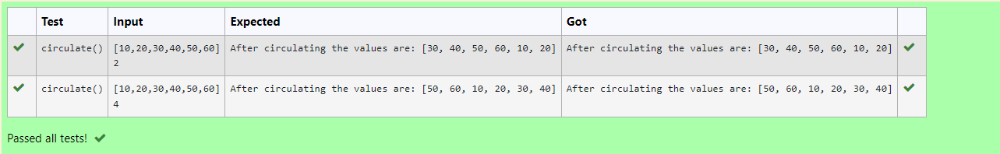

# Circulate-the-values-of-N-variables
## Aim:
To write a python program to circulate the n variables using function concept
## Equipment’s required:
PC
Anaconda - Python 3.7
## Algorithm: 
### Step 1: 
commence the program

### Step 2:
get the value from the user for the number of rotation

### Step 3:
Get the value from the user for the number of rotation

### Step 4:
Using the slicing concept rotate the list

### Step 5:
print the rotated list

### Step 6:
end the program

## Program:
```
#Program to circulate N values.
#Developed by: SRI KARTHICKEYAN GANAPATHY
#RegisterNumber:22008592
def circulate():
    a=eval(input())
    b=int(input())
    c=a[b:]+a[:b]
    print("After circulating the values are:",c)
```

## Output:


## Result:
Thus the program to circulate the values of n variables is executed.
